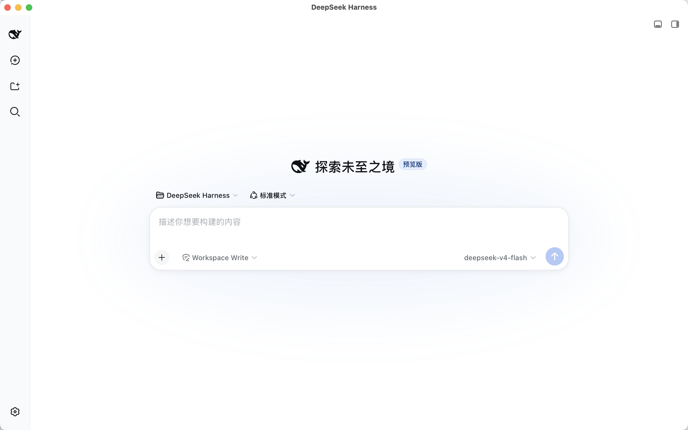

# DeepSeek Harness Desktop Launcher

> 一键启动 DeepSeek Harness，原生 macOS 独立窗口体验。



## 📥 安装

### 方式一：命令一键安装

```bash
curl --fail --silent --show-error https://raw.githubusercontent.com/Aussi12/DSH-Desktop-Launcher/main/install.sh | sh
```

### 方式二：手动下载 DMG 安装

从 [GitHub Releases](https://github.com/Aussi12/DSH-Desktop-Launcher/releases/latest) 下载 `DeepSeek-Harness.dmg`，打开后将 `DeepSeek-Harness.app` 拖到 `/Applications` 即可。

## ✨ 特性

- 双击打开直接启动，无需手动敲命令
- 原生 macOS WKWebView 独立窗口，不占用浏览器标签页
- 关闭窗口自动终止后台服务
- 要求：已安装 Node.js (`npx` 命令可用)

## 🚀 使用

安装完成后，在 Launchpad 找到 **DeepSeek Harness** 双击打开即可。

第一次打开会自动下载 `@deepseek-ai/dsh` 从 npm。

## 🔧  Requirements

- macOS 10.13+
- Node.js 14+ (with `npx`)

## 📝 说明

本项目只是打包了启动脚本和原生窗口封装，`@deepseek-ai/dsh` 来自官方 [deepseek-ai/deepseek-harness](https://github.com/deepseek-ai/deepseek-harness)。

## License

MIT
